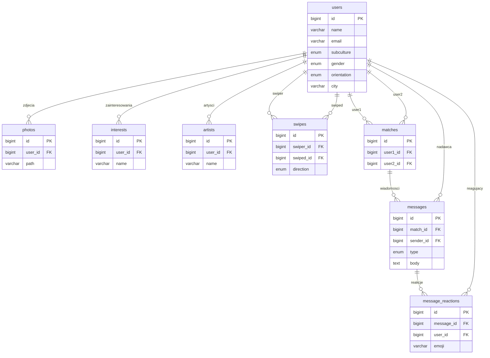

<div align="center">

# Altermatch

**Aplikacja randkowa dla alternatywnych subkultur**

*Emo · Goth · Scene · Punk · Metalhead*


</div>

---

Altermatch działa na zasadzie swipe left/right — filtruje kandydatów według subkultury, płci, orientacji, wieku i odległości. Zamiast szerokiej publiczności celuje w osoby, które wiedzą czym jest *goth* i nie tłumaczą sobie nawzajem skrótów nazw zespołów.

> Projekt zrealizowany w ramach **Programowania i Projektowania Systemów Informatycznych 1**  
> Collegium Witelona, Legnica · gr. S2PAM1 · [github.com/Mallinowo/Projekt](https://github.com/Mallinowo/Projekt)

---

## Funkcje

**Profil i onboarding**
- Rejestracja z wyborem subkultury, płci i orientacji
- Onboarding po pierwszym logowaniu — zdjęcia, bio, zainteresowania, artyści
- Edycja profilu: galeria do 6 zdjęć, zainteresowania (5–15), ulubieni artyści
- Preferencje odkrywania: zakres wieku, dystans, preferowane subkultury
- Opcjonalna integracja ze Spotify (OAuth2, import top artists)
- Lokalizacja PL / EN

**Odkrywanie**
- Karty kandydatów z filtrowaniem po wieku, subkulturze, odległości i zgodności płci/orientacji
- Akcje: pomiń, like, superlike — przyciskami i gestem drag-to-swipe
- Odległość liczona formułą Haversine na podstawie geokodowanych miast
- Lista kandydatów cachowana w Redis

**Czat i dopasowania**
- Wzajemne polubienie tworzy match + e-mail z powiadomieniem
- Czat tekstowy i GIF (Tenor v2 / GIPHY z fallbackiem)
- Reakcje emoji na wiadomości, odznaczanie jako przeczytane
- Polling bez WebSocketów

**API**
- REST API: lista profili, profil po ID, słownik subkultur (`/api/v1/*`)
- Integracje: Spotify, Tenor/GIPHY, Open-Meteo Geocoding

---

## Stack technologiczny

| Warstwa | Technologia |
|---------|-------------|
| Framework | Laravel 11 (PHP 8.2) |
| Frontend | Blade · Tailwind CSS · Vanilla JS |
| Baza danych | MySQL 8 |
| Cache / Sesje | Redis (Predis) |
| ORM | Eloquent |
| Auth | Laravel Auth + Sanctum |
| Mailing | Laravel Mail + Mailpit (dev) |
| Lokalizacja | Laravel i18n (PL/EN) |
| Zewnętrzne API | Spotify · Tenor/GIPHY · Open-Meteo |
| Deployment | Docker + Docker Compose |

---

## Architektura

```
Browser → Nginx → PHP-FPM / Laravel 11
                      │
          ┌───────────┼───────────────┐
          │           │               │
        MySQL 8     Redis         Mailpit
     (Eloquent ORM) (cache/sesje) (dev mail)
```

**Kontrolery:** `AuthController` · `OnboardingController` · `DiscoverController` · `SwipeController` · `ChatController` · `ProfileController` · `SpotifyController` · `ApiController`

**Modele i relacje:**
- `User` → hasMany `Photo`, `Interest`, `Artist`, `Swipe`
- `User` ↔ `User` → belongsToMany przez `UserMatch`
- `UserMatch` → hasMany `Message` → hasMany `MessageReaction`

### Schemat bazy danych (ERD)



---

## Uruchomienie

### Wymagania

- Docker + Docker Compose
- Wolne porty: `8080`, `8025`, `3307`

### Kroki

```bash
git clone https://github.com/Mallinowo/Projekt && cd Projekt
cp .env.example .env
docker compose up -d --build
docker compose exec app php artisan key:generate
docker compose exec app php artisan migrate --seed
docker compose exec app php artisan storage:link
```

| Serwis | URL |
|--------|-----|
| Aplikacja | http://localhost:8080 |
| Mailpit | http://localhost:8025 |
| MySQL | localhost:3307 |

```bash
# Reset środowiska
docker compose exec app php artisan migrate:fresh --seed
docker compose exec app php artisan optimize:clear
```

---

## Konta demo

Hasło dla wszystkich: `demo123`

| E-mail | Imię | Subkultura |
|--------|------|------------|
| `moon@demo.pl` | Klaudia | emo |
| `void@demo.pl` | Krystian | goth |
| `goth@demo.pl` | Julka | scene |
| `rain@demo.pl` | Oliwier | punk |
| `crypt@demo.pl` | Luciusz | metalhead |

---

## REST API

Endpointy publiczne, bez uwierzytelnienia.

```http
GET /api/v1/profiles          # lista profili (paginacja)
GET /api/v1/profiles/{id}     # profil po ID
GET /api/v1/subcultures       # słownik subkultur
```

<details>
<summary>Przykładowa odpowiedź <code>GET /api/v1/profiles</code></summary>

```json
{
  "data": [
    {
      "id": 1,
      "name": "Klaudia",
      "age": 22,
      "subculture": "emo",
      "city": "Warszawa",
      "bio": "...",
      "avatar_url": "http://localhost:8080/storage/..."
    }
  ],
  "meta": { "current_page": 1, "last_page": 2 }
}
```

</details>

---

## Zmienne środowiskowe

Plik `.env.example` zawiera domyślną konfigurację dla Docker Compose. Integracje Spotify i GIF działają bez kluczy (funkcje są wyłączone).

| Zmienna | Opis |
|---------|------|
| `TENOR_API_KEY` | Tenor GIF API |
| `GIPHY_API_KEY` | GIPHY API (fallback) |
| `SPOTIFY_CLIENT_ID` / `_SECRET` | Spotify OAuth2 |
| `SPOTIFY_REDIRECT_URI` | URI callbacku Spotify |

---

## Podgląd


Warianty kolorystyczne: [docs/color-variants.html](docs/color-variants.html)

---

## Autorzy

| Imię i nazwisko | Nr albumu |
|-----------------|-----------|
| Jakub Maliński | 45891 |
| Michał Kuchar | 44924 |
| Wojciech Kasprzyk | 44918 |
