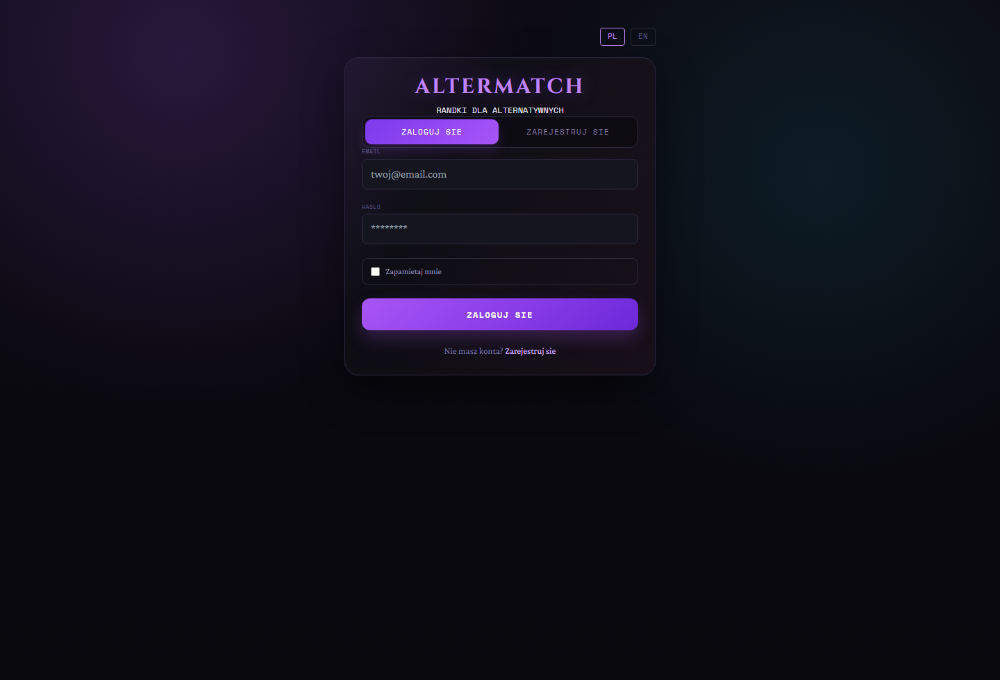
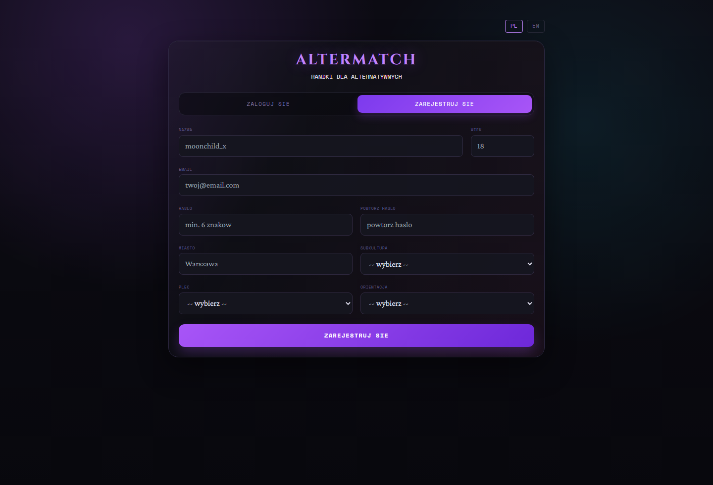
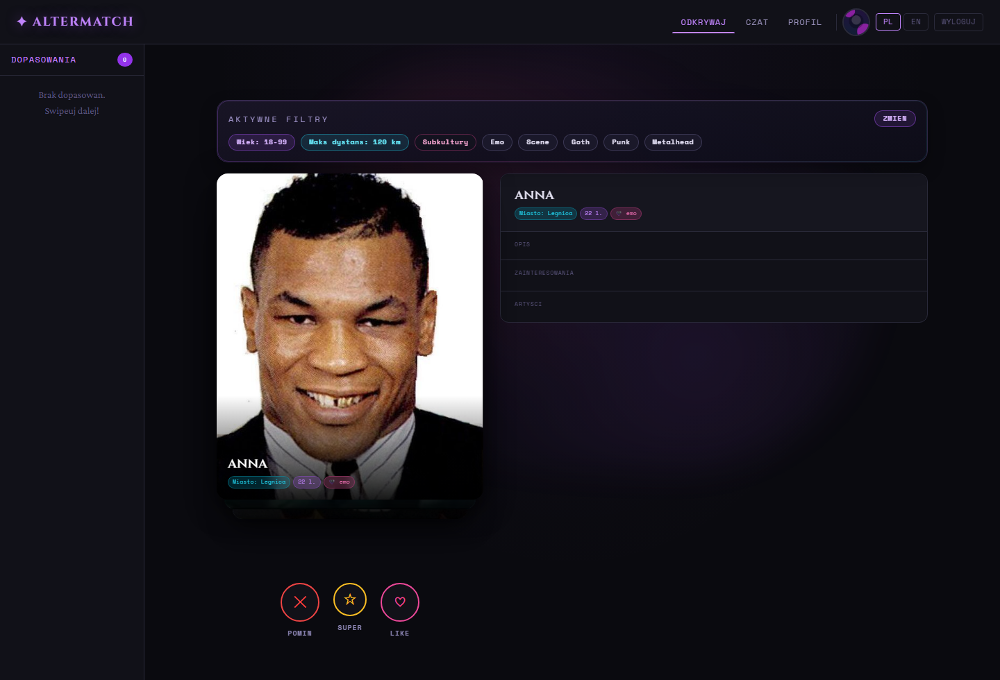
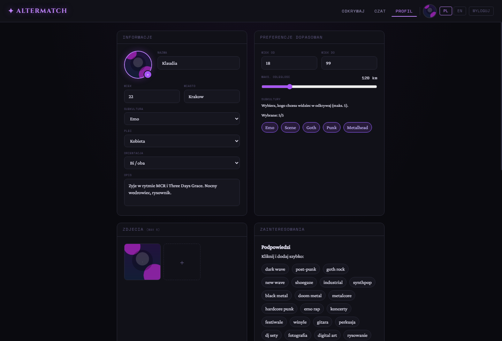

# Altermatch

Aplikacja randkowa dla alternatywnych subkultur — emo, goth, scene, punk, metalhead. Zbudowana na Laravel 11, MySQL, Redis i Tailwind CSS. Działa w pełni przez Docker.

## Spis treści

- [Funkcje](#funkcje)
- [Stack technologiczny](#stack-technologiczny)
- [Architektura](#architektura)
- [Uruchomienie](#uruchomienie)
- [Konta demo](#konta-demo)
- [REST API](#rest-api)
- [Zmienne środowiskowe](#zmienne-środowiskowe)
- [Struktura projektu](#struktura-projektu)
- [Sprawozdanie](#sprawozdanie)
- [Autorzy](#autorzy)

---

## Funkcje

### Rejestracja i profil
- Rejestracja z wyborem subkultury, płci i orientacji
- Onboarding po pierwszym logowaniu (zdjęcie, bio, zainteresowania, artyści)
- Edycja profilu: galeria do 6 zdjęć, zainteresowania (5–15), ulubieni artyści
- Preferencje odkrywania: zakres wieku, maksymalny dystans, preferowane subkultury
- Opcjonalna integracja ze Spotify (OAuth2, pobieranie ulubionych artystów)
- Lokalizacja PL/EN

### Odkrywanie profili
- Karty kandydatów z filtrowaniem po wieku, subkulturze, odległości i zgodności płci/orientacji
- Akcje: pomiń, like, superlike — obsługiwane przyciskami i gestem przeciągania
- Obliczanie odległości formułą Haversine na podstawie geokodowanych miast
- Caching listy kandydatów w Redis

### Dopasowania i czat
- Wzajemne polubienie tworzy dopasowanie (match)
- E-mail powiadomienie o nowym matchu
- Czat tekstowy i GIF (Tenor / GIPHY)
- Reakcje emoji na wiadomości
- Odznaczanie wiadomości jako przeczytanych
- Polling bez WebSocketów

### API i integracje
- REST API: lista profili, profil po ID, słownik subkultur
- Spotify API — wyszukiwanie artystów, pobieranie top artists
- Tenor v2 / GIPHY — wyszukiwanie GIF-ów z fallbackiem
- Open-Meteo Geocoding — zamiana nazwy miasta na współrzędne

---

## Stack technologiczny

| # | Zagadnienie | Technologia |
|---|-------------|-------------|
| 1 | Framework MVC | Laravel 11 (PHP 8.2) |
| 2 | Framework CSS | Tailwind CSS |
| 3 | Baza danych | MySQL 8 |
| 4 | Cache | Redis (Predis) |
| 5 | Dependency manager | Composer + npm / Vite |
| 6 | HTML | Blade templates |
| 7 | CSS | Tailwind CSS + własne style |
| 8 | JavaScript | Vanilla JS, Fetch API |
| 9 | Routing | Laravel Router + Nginx |
| 10 | ORM | Eloquent |
| 11 | Uwierzytelnianie | Laravel Auth + Sanctum |
| 12 | Lokalizacja | Laravel i18n (PL/EN) |
| 13 | Mailing | Laravel Mail + Mailpit (dev) |
| 14 | Formularze | Blade + CSRF + Request Validation |
| 15 | Asynchroniczność | Fetch API, polling, dynamiczne UI |
| 16 | Konsumpcja API | Spotify, Tenor/GIPHY, Open-Meteo |
| 17 | Publikacja API | REST API `/api/v1/*` |
| 18 | RWD | Tailwind responsive breakpoints |
| 19 | Logger | Laravel Log (rejestracja, swipe, mail, Spotify) |
| 20 | Deployment | Docker + Docker Compose |

---

## Architektura

```
Browser
  │
  ▼
Nginx (port 8080)
  │
  ▼
PHP-FPM / Laravel 11
  ├── AuthController       → rejestracja, logowanie, locale
  ├── OnboardingController → wizard po rejestracji
  ├── DiscoverController   → kandydaci z filtrowaniem i cache
  ├── SwipeController      → zapis decyzji, tworzenie matchy
  ├── ChatController       → wiadomości, GIF-y, reakcje
  ├── ProfileController    → edycja profilu, upload zdjęć
  ├── SpotifyController    → OAuth2 + artyści
  └── ApiController        → REST API /api/v1/*
  │
  ├── MySQL 8    ← migracje Eloquent, relacje
  ├── Redis      ← cache discover, API, sesje, GIF-y
  └── Mailpit    ← lokalne przechwytywanie maili (dev)
```

**Modele i relacje:**
- `User` → hasMany `Photo`, `Interest`, `Artist`, `Swipe`
- `User` ↔ `User` → belongsToMany przez `UserMatch`
- `UserMatch` → hasMany `Message` → hasMany `MessageReaction`

---

## Uruchomienie

### Wymagania

- Docker
- Docker Compose
- Wolne porty: `8080`, `8025`, `3307`

### Kroki

```bash
# 1. Sklonuj repozytorium
git clone <adres_repozytorium>
cd altermatch

# 2. Skopiuj plik środowiskowy
cp .env.example .env

# 3. Zbuduj i uruchom kontenery
docker compose up -d --build

# 4. Wygeneruj klucz aplikacji
docker compose exec app php artisan key:generate

# 5. Uruchom migracje i seedery
docker compose exec app php artisan migrate --seed

# 6. Utwórz symlink do storage
docker compose exec app php artisan storage:link
```

### Dostęp

| Serwis | URL |
|--------|-----|
| Aplikacja | http://localhost:8080 |
| Mailpit (poczta dev) | http://localhost:8025 |
| MySQL | localhost:3307 |

### Resetowanie środowiska

```bash
# Wyczyść cache po zmianach konfiguracji
docker compose exec app php artisan optimize:clear

# Przebuduj bazę z seederami
docker compose exec app php artisan migrate:fresh --seed
```

---

## Konta demo

Hasło dla wszystkich kont: `demo123`

| E-mail | Imię | Subkultura | Płeć |
|--------|------|------------|------|
| `moon@demo.pl` | Klaudia | emo | kobieta |
| `void@demo.pl` | Krystian | goth | mężczyzna |
| `goth@demo.pl` | Julka | scene | kobieta |
| `rain@demo.pl` | Oliwier | punk | mężczyzna |
| `crypt@demo.pl` | Luciusz | metalhead | mężczyzna |

### Szybki test

1. Otwórz http://localhost:8080
2. Zaloguj się jako `moon@demo.pl` / `demo123`
3. Przejdź do **Odkrywaj** i wykonaj kilka swipe'ów
4. Zmień filtry odkrywania w **Profil**
5. Otwórz **Czat** — sprawdź wiadomości i GIF-y
6. Sprawdź maile na http://localhost:8025

---

## REST API

Publiczne endpointy nie wymagają uwierzytelnienia.

### Pobierz listę profili

```http
GET /api/v1/profiles?page=1
```

Odpowiedź:
```json
{
  "data": [
    {
      "id": 1,
      "name": "Klaudia",
      "age": 22,
      "subculture": "emo",
      "city": "Warszawa",
      "bio": "...",
      "avatar_url": "http://localhost:8080/storage/..."
    }
  ],
  "meta": { "current_page": 1, "last_page": 2 }
}
```

### Pobierz profil po ID

```http
GET /api/v1/profiles/{id}
```

### Pobierz słownik subkultur

```http
GET /api/v1/subcultures
```

Odpowiedź:
```json
{
  "emo": { "label": "Emo", "icon": "🖤" },
  "goth": { "label": "Goth", "icon": "🦇" },
  "scene": { "label": "Scene", "icon": "🌈" },
  "punk": { "label": "Punk", "icon": "⚡" },
  "metalhead": { "label": "Metalhead", "icon": "🤘" }
}
```

### Przykład użycia

```bash
curl http://localhost:8080/api/v1/profiles
curl http://localhost:8080/api/v1/profiles/1
curl http://localhost:8080/api/v1/subcultures
```

---

## Zmienne środowiskowe

Plik `.env.example` zawiera domyślną konfigurację dla Docker Compose.

| Zmienna | Opis |
|---------|------|
| `APP_URL` | Adres aplikacji (domyślnie `http://localhost:8080`) |
| `DB_HOST` / `DB_DATABASE` | Konfiguracja MySQL |
| `CACHE_STORE=redis` | Backend cache |
| `SESSION_DRIVER=redis` | Backend sesji |
| `MAIL_HOST=mailpit` | Serwer pocztowy (dev) |
| `TENOR_API_KEY` | Klucz do Tenor GIF API |
| `GIPHY_API_KEY` | Klucz do GIPHY API |
| `SPOTIFY_CLIENT_ID` | Spotify OAuth2 Client ID |
| `SPOTIFY_CLIENT_SECRET` | Spotify OAuth2 Client Secret |
| `SPOTIFY_REDIRECT_URI` | URI callbacku Spotify |

Integracje Spotify i GIF działają bez kluczy (funkcje są po prostu wyłączone).

---

## Struktura projektu

```
altermatch/
├── app/
│   ├── Http/Controllers/   # AuthController, DiscoverController, ChatController...
│   ├── Models/             # User, Photo, Swipe, UserMatch, Message, MessageReaction
│   └── Services/           # SpotifyService, GifService, CityLocationService
├── database/
│   ├── migrations/         # Schemat bazy (users, photos, swipes, matches, messages...)
│   └── seeders/            # DatabaseSeeder z kontami demo
├── resources/
│   ├── views/              # Blade: auth, discover, chat, profile, onboarding, emails
│   └── lang/               # Tłumaczenia PL/EN
├── routes/
│   ├── web.php             # Trasy web (auth, discover, swipe, chat, profile, spotify)
│   └── api.php             # Trasy REST API /api/v1/*
├── public/js/
│   ├── discover.js         # Animacje kart, swipe, popup matcha
│   └── chat.js             # Wiadomości, GIF-y, reakcje, polling
├── docker-compose.yml      # app, nginx, mysql, redis, mailpit
└── sprawozdanie.tex        # Sprawozdanie projektu (LaTeX)
```

---

## Podgląd






Warianty kolorystyczne: [docs/color-variants.html](docs/color-variants.html)

## Autorzy

| Imię i nazwisko | Nr albumu |
|-----------------|-----------|
| Jakub Maliński | 45891 |
| Michał Kuchar | 44924 |
| Wojciech Kasprzyk | 44918 |

Projekt realizowany w ramach: **Programowanie i Projektowanie Systemów Informatycznych 1**  
Uczelnia: Collegium Witelona, Legnica  
Repozytorium: <https://github.com/Mallinowo/Projekt>

